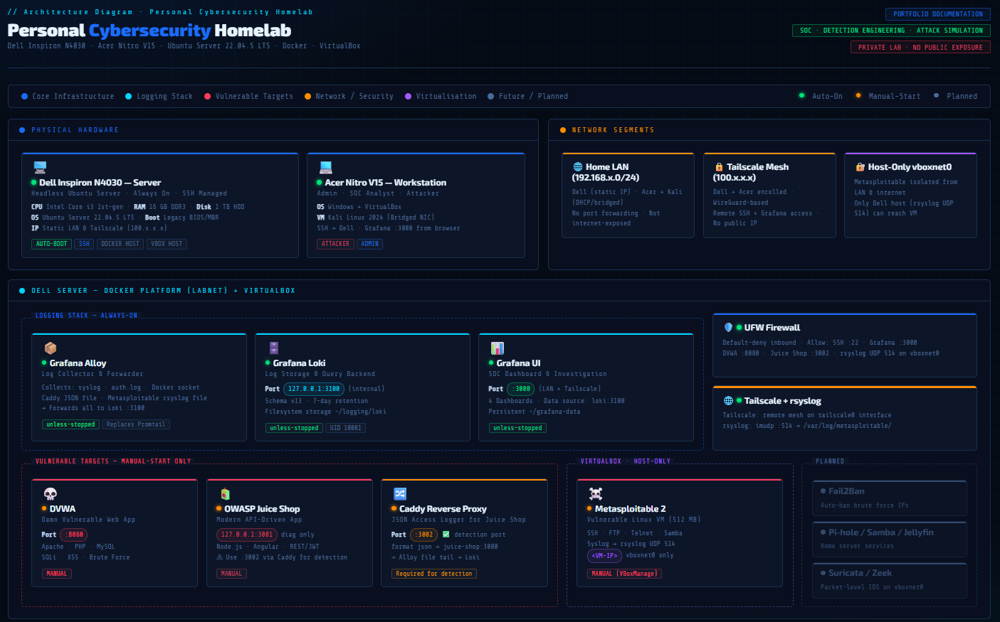
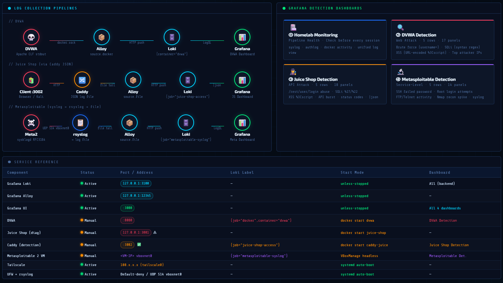

<!-- HEADER -->

<p align="center">
  
</p>

<h1 align="center">Personal Cybersecurity Homelab</h1>

<p align="center">
  <b>A private cybersecurity lab for attack simulation, log collection, and SOC-style detection engineering.</b><br>
  Built with <b>Ubuntu Server · Docker · Grafana Alloy · Loki · Grafana · DVWA · OWASP Juice Shop · Metasploitable 2</b>
</p>

<p align="center">
  <i>From vulnerable targets to detection dashboards, this lab shows what attacks look like from the defender’s side.</i>
</p>

<p align="center">
  
  
  
  
  
  
</p>

## Overview

This repository documents my personal cybersecurity homelab.

The goal of this project is simple:

> Run controlled attacks inside a private lab, collect the logs, write detection logic, and build dashboards that show the evidence clearly.

The lab combines offensive security practice with defensive monitoring. Instead of only exploiting vulnerable machines, I focused on understanding how those actions appear in logs and how a SOC analyst would investigate them.

This project includes:

* A repurposed Dell Inspiron N4030 running Ubuntu Server
* Docker-based vulnerable web targets
* DVWA for classic web attack practice
* OWASP Juice Shop for modern API-driven attack visibility
* Metasploitable 2 for service-level detection
* Grafana Alloy for log collection
* Grafana Loki for log storage and querying
* Grafana dashboards for monitoring and detection
* rsyslog forwarding for VM-based log ingestion
* A complete PDF documenting the build, design choices, queries, issues, and lessons learned

---

## Full Documentation

The full technical documentation is available here:

<p align="center">
  <a href="./Homelab Documentation.pdf">
    
  </a>
</p>

The PDF contains the complete build process, architecture, setup commands, dashboard logic, troubleshooting notes, limitations, and future roadmap.

---

## What This Homelab Does

This homelab is built around an attack-to-log workflow.

| Step | What Happens                                                         |
| ---- | -------------------------------------------------------------------- |
| 1    | A controlled attack is performed against a lab target                |
| 2    | Logs are collected from the host, containers, reverse proxy, or VM   |
| 3    | Grafana Alloy forwards logs to Loki                                  |
| 4    | Loki stores the logs with useful labels                              |
| 5    | Grafana dashboards query the logs with LogQL                         |
| 6    | Detection panels show activity, source attribution, and raw evidence |

The focus is not only on making attacks work. The focus is on proving what happened through log evidence.

---

## Lab Architecture

The lab uses role separation.

| Component           | Role                                                 |
| ------------------- | ---------------------------------------------------- |
| Dell Inspiron N4030 | Homelab server and monitored environment             |
| Acer Nitro V15      | Workstation for admin, analysis, and documentation   |
| Kali Linux VM       | Controlled attacker machine                          |
| Docker              | Runs most lab services and vulnerable web apps       |
| VirtualBox          | Runs Metasploitable 2 as a lightweight vulnerable VM |
| Grafana Alloy       | Collects host, container, Caddy, and VM logs         |
| Grafana Loki        | Stores logs and supports LogQL queries               |
| Grafana             | Displays monitoring and detection dashboards         |

The vulnerable targets are manually started only when needed. The monitoring stack remains available so logs and dashboards can be checked before each test session.

---

## Detection Coverage

The current dashboards cover three visibility layers.

### Web Application Layer

DVWA and OWASP Juice Shop are used to test web attack patterns.

Detected activity includes:

* Brute force attempts
* SQL injection patterns
* XSS payload indicators
* Request bursts
* Sensitive endpoint access
* API route activity
* Suspicious HTTP status codes

### System and Service Layer

Metasploitable 2 adds service-level visibility beyond web logs.

Detected activity includes:

* SSH authentication failures
* Root login attempts
* FTP activity
* Telnet activity
* Service connection spikes
* Reconnaissance patterns
* Suspicious syslog entries

### Infrastructure Health Layer

The monitoring dashboard checks whether the logging pipeline is working.

It tracks:

* Syslog activity
* Auth log activity
* Docker log activity
* Unified log streams
* Dashboard data availability

---

## Dashboards

| Dashboard                | Purpose                                                                      |
| ------------------------ | ---------------------------------------------------------------------------- |
| Homelab Monitoring       | Checks log pipeline health before testing                                    |
| DVWA Detection           | Detects brute force, SQLi, XSS, and web behaviour                            |
| Juice Shop Detection     | Detects API abuse, login attempts, injection indicators, and status patterns |
| Metasploitable Detection | Detects SSH failures, FTP/Telnet activity, recon, and service-level events   |

Each dashboard separates high-level metrics from raw evidence panels. This makes the workflow closer to real SOC triage: detect, investigate, validate.

---

## Log Collection Pipelines

The lab uses different pipelines depending on the target.

| Target           | Log Source                     | Collection Method           | Loki Label                          |
| ---------------- | ------------------------------ | --------------------------- | ----------------------------------- |
| DVWA             | Apache logs from Docker stdout | Alloy Docker discovery      | `{job="docker", container="dvwa"}`  |
| Juice Shop       | Caddy JSON access logs         | Alloy file tailing          | `{job="juice-shop-access"}`         |
| Metasploitable 2 | Linux syslog                   | rsyslog to file, then Alloy | `{job="metasploitable-syslog"}`     |
| Ubuntu Host      | syslog and auth.log            | Alloy file tailing          | `{job="syslog"}`, `{job="authlog"}` |

Juice Shop required a Caddy reverse proxy because the application container did not provide useful HTTP access logs by default. Caddy creates structured JSON logs that are easier to parse and query in Loki.

Metasploitable required rsyslog because it runs as a separate VM and cannot be collected through Docker.

---

## Key Technical Decisions

| Decision                            | Reason                                                            |
| ----------------------------------- | ----------------------------------------------------------------- |
| Ubuntu Server instead of desktop OS | Lower overhead and better server-style management                 |
| Docker for most services            | Lightweight, repeatable, and easier to reset                      |
| Loki instead of ELK                 | More suitable for older hardware with limited CPU and HDD storage |
| Grafana Alloy instead of Promtail   | Alloy is the modern Grafana log collector                         |
| Caddy in front of Juice Shop        | Adds request-level JSON access logging                            |
| VirtualBox for Metasploitable 2     | Simple host-only VM setup on the Dell server                      |
| Manual start for vulnerable targets | Reduces unnecessary attack surface                                |
| Separate dashboards per target      | Different logs need different detection logic                     |

---

## What I Learned

This project helped me practice:

* Linux server administration
* Docker container deployment and networking
* Log collection and forwarding
* Grafana Loki and LogQL
* SOC-style dashboard design
* Web attack detection
* Service-level detection
* Troubleshooting broken pipelines
* Separating monitoring from detection
* Writing documentation that explains decisions, not only commands

The biggest lesson was that detection depends on visibility. If the right logs are not collected, the dashboard cannot detect anything useful.

---

## Repository Structure

```text
personal-cybersecurity-homelab/
├── README.md
├── Personal-Cybersecurity-Homelab-SOC-Detection-Portfolio.pdf
└── assets/
    ├── homelab-architecture.png
    └── log-collection-pipelines.png
```

---

## Screenshots

### Architecture Diagram

<p align="center">
  
</p>

### Log Collection and Detection Overview

<p align="center">
  
</p>

---

## Project Status

| Area                                      | Status        |
| ----------------------------------------- | ------------- |
| Ubuntu Server setup                       | Complete      |
| Docker platform                           | Complete      |
| Tailscale access                          | Complete      |
| UFW firewall baseline                     | Complete      |
| Loki, Alloy, Grafana                      | Complete      |
| Homelab Monitoring Dashboard              | Complete      |
| DVWA deployment and detection             | Complete      |
| Juice Shop deployment and detection       | Complete      |
| Metasploitable 2 deployment and detection | Complete      |
| Full PDF documentation                    | Complete      |
| Grafana alerting                          | Planned       |
| Pi-hole, Samba, Jellyfin                  | Planned       |
| Suricata or Zeek                          | Future option |

---

## Security Scope

This is a private lab environment.

* No vulnerable services are exposed to the public internet
* Vulnerable targets are started manually for testing
* Metasploitable runs on an isolated host-only network
* Remote access is handled through Tailscale
* Screenshots and documentation are sanitized before sharing

All testing is limited to systems owned and controlled inside the lab.

---

## Future Improvements

Planned improvements include:

* Grafana alerting for selected detections
* Better dashboard exports and persistence
* More refined LogQL detection queries
* DNS filtering with Pi-hole
* File sharing with Samba
* Media hosting with Jellyfin
* Possible packet-level visibility with Suricata or Zeek
* More structured incident-style writeups from simulated attacks

---

## Final Note

This project started as a way to turn old hardware into something useful.

It became a full cybersecurity learning environment where attacks, logs, dashboards, and documentation all connect into one workflow.

The main takeaway:

> A good homelab does not just run tools. It helps you understand what the tools are doing, what evidence they leave behind, and how to explain that evidence clearly.
